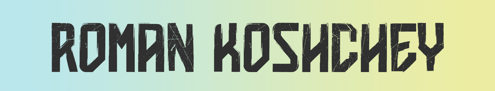

## A junior software developer from Ukraine

- I’m currently working on [LETA](https://github.com/Koshcher/LETA)

- I’m currently learning **c#, wxWidgets**

-  How to reach me **romankoshchey@gmail.com**

## Languages and Tools
 

## Follow Me

